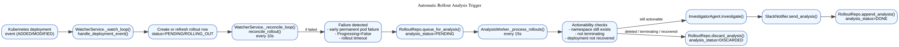
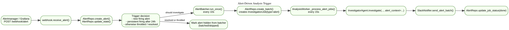
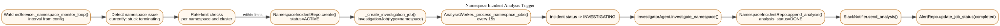
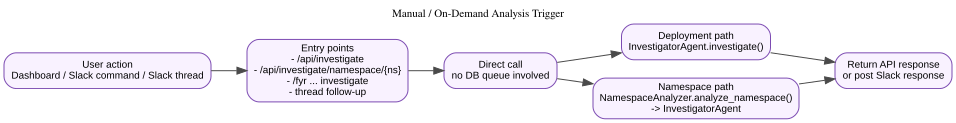

% Project Fyr Analysis Triggering Walkthrough
% Codex
% 2026-03-06

# Purpose

This document explains how Project Fyr decides to start an analysis, which runtime component owns each trigger path, and how that work is persisted and notified.

It covers four active trigger paths:

- Automatic rollout failure analysis
- Alert-driven analysis
- Namespace incident analysis
- Manual on-demand analysis from dashboard or Slack

It also records one verified bug in the current codebase: pending namespace investigation jobs were eligible for the alert-job worker and could be consumed by the wrong path.

# Runtime Components

The main runtime actors are:

- `WatcherService`: watches deployments, reconciles rollout state, and monitors namespaces.
- `AnalyzerService`: runs the alert batcher and the `AnalysisWorker`.
- `AnalysisWorker`: consumes pending rollout, alert, and namespace work.
- `RolloutRepo` / `AlertRepo` / `NamespaceIncidentRepo`: persist queue state and analysis state.
- `InvestigatorAgent`: runs the LLM-backed investigation.
- `SlackNotifier`: emits the resulting Slack notification.

Primary source locations:

- `project_fyr/service.py:31`
- `project_fyr/service.py:256`
- `project_fyr/service.py:687`
- `project_fyr/service.py:716`
- `project_fyr/service.py:754`
- `project_fyr/service.py:915`
- `project_fyr/service.py:1324`
- `project_fyr/db.py:216`
- `project_fyr/db.py:563`
- `project_fyr/db.py:842`

# 1. Automatic Rollout Failure Analysis

The automatic rollout path is the main trigger mechanism for failed deployments.

## Sequence

1. `WatcherService._watch_loop()` receives Kubernetes deployment events and calls `handle_deployment_event()`.
2. Fyr creates or refreshes a rollout record for the observed deployment generation.
3. `WatcherService._reconcile_loop()` runs every 10 seconds over active rollouts.
4. `reconcile_rollout()` decides whether the rollout is still progressing, has succeeded, or has failed.
5. If Fyr sees a real failure, it stores trigger context and marks the rollout `analysis_status=PENDING` using `queue_for_analysis()`.
6. `AnalysisWorker._process_rollouts()` runs every 15 seconds and fetches failed rollouts where `analysis_status == PENDING`.
7. Before spending LLM budget, the worker checks whether the namespace or deployment has already disappeared or recovered.
8. If the rollout is still actionable, Fyr runs `InvestigatorAgent.investigate()`.
9. Fyr sends the Slack notification, then persists the analysis record and marks the rollout `analysis_status=DONE`.

## What counts as a rollout trigger

`reconcile_rollout()` currently queues analysis for three failure classes:

- Early permanent pod failure, based on pod failure signals.
- Kubernetes reporting `Progressing=False`.
- Rollout timeout.

That logic lives in:

- `project_fyr/service.py:1343`
- `project_fyr/service.py:1399`
- `project_fyr/service.py:1415`

## Important state detail

Rollout analysis is not driven by `InvestigationJob`.

The actual trigger is the state transition to `rollouts.analysis_status = PENDING`, and the consumer is `RolloutRepo.list_failed()`.

# 2. Alert-Driven Analysis

Alerts use a different trigger path from rollouts.

## Sequence

1. Alertmanager or Grafana calls `POST /webhook/alert`.
2. Fyr validates the secret, stores the raw alert, and consults `alert_states`.
3. Fyr decides whether the alert should be investigated now or suppressed by sticky throttling.
4. The `AlertBatcher` runs every 10 seconds and groups eligible alerts inside the correlation window.
5. `AlertRepo.create_batch()` creates an `alert_batches` row and an `InvestigationJob(type="alert", status="pending")` row.
6. `AnalysisWorker._process_alert_jobs()` picks up pending alert jobs and calls `InvestigatorAgent.investigate(..., alert_context=...)`.
7. Fyr posts the alert analysis to Slack and marks the job done.

## Important state detail

This path is job-based. The durable trigger is the creation of a pending `InvestigationJob` row of type `alert`.

Primary source locations:

- `project_fyr/webhook.py:28`
- `project_fyr/webhook.py:89`
- `project_fyr/service.py:38`
- `project_fyr/db.py:842`
- `project_fyr/service.py:472`

# 3. Namespace Incident Analysis

Namespace analysis is also job-based, but it starts from the namespace monitor rather than the alert webhook.

## Sequence

1. `WatcherService._namespace_monitor_loop()` periodically scans namespaces.
2. Fyr currently looks for namespaces that are stuck in `Terminating` longer than the configured threshold.
3. Fyr applies per-namespace and per-cluster rate limits before creating any incident.
4. If allowed, Fyr creates a `namespace_incidents` row.
5. Fyr then creates `InvestigationJob(type="namespace", status="pending")`.
6. `AnalysisWorker._process_namespace_jobs()` picks up the job.
7. The worker marks the incident `INVESTIGATING`, calls `investigate_namespace()`, stores the result, posts to Slack, and marks the job completed.

Primary source locations:

- `project_fyr/service.py:754`
- `project_fyr/service.py:797`
- `project_fyr/service.py:860`
- `project_fyr/service.py:543`
- `project_fyr/service.py:574`

# 4. Manual / On-Demand Analysis

Manual investigations bypass both rollout and job queues.

## Sequence

1. A user invokes an analysis from the dashboard, a slash command, a Slack button, or a Slack thread reply.
2. The entrypoint directly creates an agent or namespace analyzer instance.
3. Fyr immediately runs the investigation and returns the response to the API caller or Slack thread.
4. This path does not create `InvestigationJob` rows and does not depend on `analysis_status=PENDING`.

Representative entry points:

- `project_fyr/dashboard.py:255`
- `project_fyr/dashboard.py:333`
- `project_fyr/slack_commands.py:221`
- `project_fyr/slack_handler.py:142`
- `project_fyr/slack_handler.py:423`
- `project_fyr/namespace_analyzer.py:57`

# Queue Model Summary

There are two distinct queueing models in Fyr today.

## Rollout queue

- Storage: `rollouts.analysis_status`
- Trigger: `queue_for_analysis()`
- Consumer: `RolloutRepo.list_failed()`
- Worker method: `_process_rollouts()`

## Investigation job queue

- Storage: `investigation_jobs`
- Trigger: `create_batch()` or `_create_investigation_job()`
- Consumer: `get_pending_alert_jobs()` and `get_pending_namespace_jobs()`
- Worker methods: `_process_alert_jobs()` and `_process_namespace_jobs()`

This split matters operationally. Looking only at `investigation_jobs` does not tell you whether rollout analysis is backed up.

# Verified Code Smell and Fix

## Symptom

`AnalysisWorker._process_alert_jobs()` originally fetched all pending `InvestigationJob` rows, not only alert jobs.

That meant a pending namespace job was eligible for the alert worker.

## Why this was wrong

A namespace job has no `alert_batch_id`. If `_process_alert_jobs()` picked it first, the job could be marked out of `pending` before `_process_namespace_jobs()` had a chance to handle it.

In practical terms, the wrong worker could steal the work item.

## Root cause

The repository method used by `_process_alert_jobs()` did not filter on `InvestigationJob.type == "alert"`.

## Fix applied

The code now uses an alert-specific selector:

- `project_fyr/db.py:get_pending_alert_jobs()`
- `project_fyr/service.py:_process_alert_jobs()`

This keeps the queue ownership aligned with the job type.

## Verification

A focused regression test was added and run in the repo virtualenv:

- `./.venv/bin/pytest -q tests/test_service.py -k process_alert_jobs_ignores_pending_namespace_jobs`
- `./.venv/bin/pytest -q tests/test_service.py -k 'alert or namespace or loop'`

Result at time of writing:

- Focused regression: passed
- Targeted alert/namespace worker slice: 8 passed

# Operational Reading Guide

When you need to know why analysis did or did not happen, inspect the system in this order.

## For rollout analysis

1. Check whether a rollout row exists for the namespace, deployment, and generation.
2. Check `status` and `analysis_status`.
3. Check whether the rollout was discarded due to namespace deletion, termination, or recovery.
4. Check analyzer logs for `_process_rollouts()` and agent execution.

## For alert analysis

1. Check whether the alert was throttled in `alert_states`.
2. Check whether enough related alerts existed to form a batch.
3. Check whether an `InvestigationJob(type="alert")` row exists.
4. Check analyzer logs for `_process_alert_jobs()`.

## For namespace analysis

1. Check whether the namespace monitor created a `namespace_incidents` row.
2. Check rate-limit decisions.
3. Check whether an `InvestigationJob(type="namespace")` row exists.
4. Check analyzer logs for `_process_namespace_jobs()`.

# Bottom Line

The main automatic rollout trigger is `queue_for_analysis()` setting `rollouts.analysis_status = PENDING`.

Alerts and namespace incidents are different: they trigger through typed `InvestigationJob` rows.

Manual investigations bypass both queues and call the agent directly.
